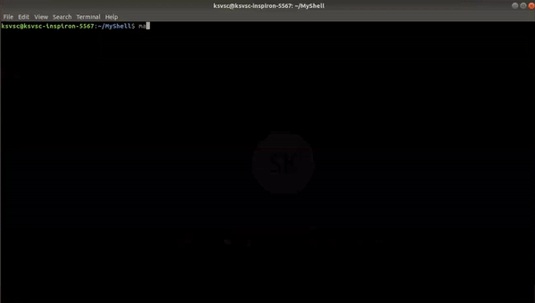

# MyShell
This is Unix shell built from scratch in C as part of the Operating Systems course at IIIT-Hyderabad. 

## Usage 
  1. Compile: `make`
  2. Run: `./a.out`

Here is a demo! 
 
  
 

## Features Implemented:
- Print working directory - `pwd`
- Change directory - `cd` (`cd ..`, `cd~` , `cd <filename>`)
- `echo` (takes care of double quotes)
- List - `ls [al]` (`ls -a`, `ls -l`, `ls -al`, `ls -la`)
- Info file viewer - `pinfo`
- Set environment variables - `setenv var [value]`
- Unset environment variables - `unsetenv var`
- Display status of jobs in terminal - `jobs`
- Kill job - `kjob <job_num> <sig_num>`
- Brings background process to foreground - `fg <job_num>`
- Send stopped background process to Running state - `bg <job_num>`
- Overkill - `overkill`
- Quit shell - `quit` or `exit`
- Suspend current foreground process - `Ctrl Z`
- Interupt current foreground process - `Ctrl C`
- Appropriate display messages regarding the background process
- Input-Output Redirection - `>`, `<`, `>>`
- Piping - Redirection using pipes
- I/O redirection + Pipes redireciton

## Added new Commands:
- Personal Reminder (reminds you with a custom message after given time lapse)- `remindme <time> <Remainder>`
- Clock Command (Displays dynamic date and time after a fixed time interval) - `clock -t <interval>`

## File Details
### main.c
This file contains code for display of prompt, getting input, parsing and execution of functions pwd, cd, fg, bg, crtl C, crtl Z.

### ls.c
This file contains code for execution of List command `ls` with various args.

### pinfo.c
This file contains code for execution of `pinfo` command.

### echo.c
This file contains code for execution of the command `echo`.

### env.c
This file contains code for setting and unsetting environment variables.

### job.c
This file contains code for listing the status of jobs started in the current terminal.

### redirect.c
This file contains code for the input and output redirection.

### clock.c
This file contains code for the execution of a new command, Clock, which I have added.

### reminder.c
This file contains code for the execution of a new command, Reminder, which I have added.